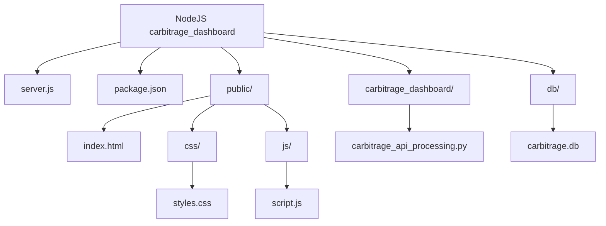

__Run npm start in bash__ Visit [page here](http://localhost:3000) and [API here](http://localhost:5000/api/unique_car_makes)

_Keeping just in case, but its probably not that useful anymore 🤷‍♂️_:

* Old:
Run node server.js in bash. 
For carbitrage run 'cabbitrage_api_processing.py' in powershell.

